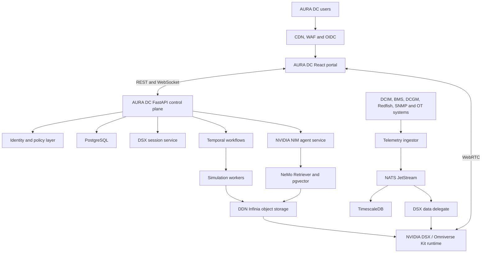
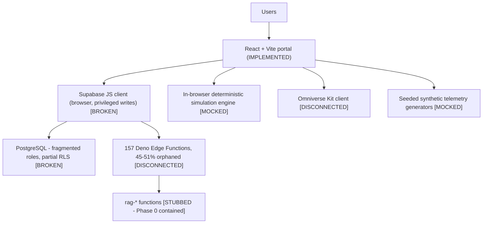

# AURA DC — Architecture

## Target architecture

## Current architecture (verified 2026-08-07)

## Component status

| Component | Target | Today | Status |
|---|---|---|---|
| Web portal | React/TS strict/Vite | React/TS/Vite, strict partial | IMPLEMENTED |
| Control plane | FastAPI modular monolith | Supabase Edge Functions | PLANNED |
| Identity | OIDC + central RBAC/ABAC | Supabase Auth + two conflicting role systems | BROKEN |
| Operational data | PostgreSQL + RLS + tenant_id | PostgreSQL, no tenant model, partial RLS | BROKEN |
| Time-series | TimescaleDB | none | PLANNED |
| Events | NATS JetStream | none | PLANNED |
| Workflows | Temporal | none | PLANNED |
| Object storage | DDN Infinia (S3 API) | none | PLANNED |
| Digital twin | DSX + Omniverse Kit + OpenUSD | Kit client present, transport disabled | DISCONNECTED |
| Twin delivery | NVIDIA WebRTC streaming | none | PLANNED |
| AI inference | NVIDIA NIM | browser LLM client disabled | STUBBED |
| Retrieval | NeMo Retriever + pgvector | none | STUBBED |
| Observability | OpenTelemetry stack | console logging | PLANNED |
| Deployment | K8s + Helm + Terraform + Argo CD | static hosting | PLANNED |

## Target repository organization

`apps/{web,api,dsx-session-service,telemetry-ingestor,agent-service}`,
`workers/{simulation-worker,document-ingestion-worker}`,
`packages/{ui,contracts,auth,observability,dsx-client,telemetry-client}`,
`infrastructure/{docker,kubernetes,helm,terraform,argocd}`,
`database/{migrations,seeds,policies}`, `docs/`, `tests/`.

Migration is incremental. `src/` remains the live web application until
`apps/web` passes its acceptance gate.
