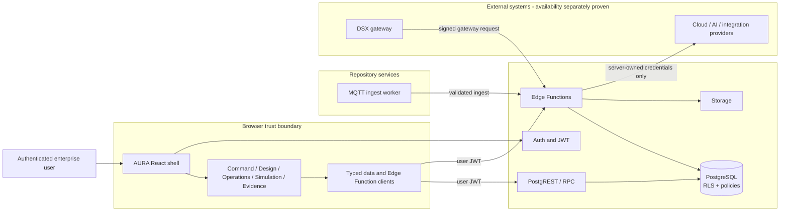
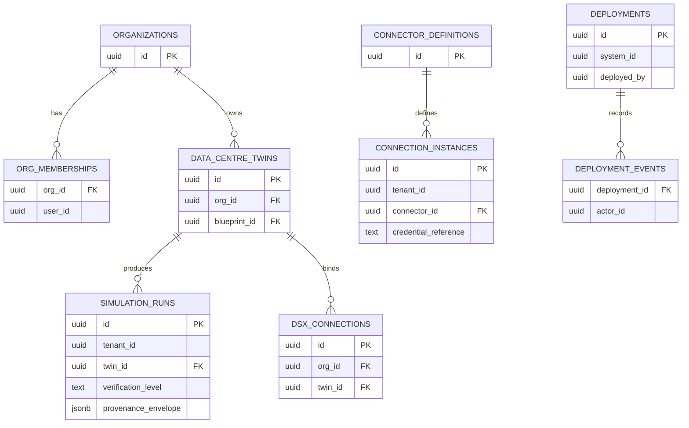
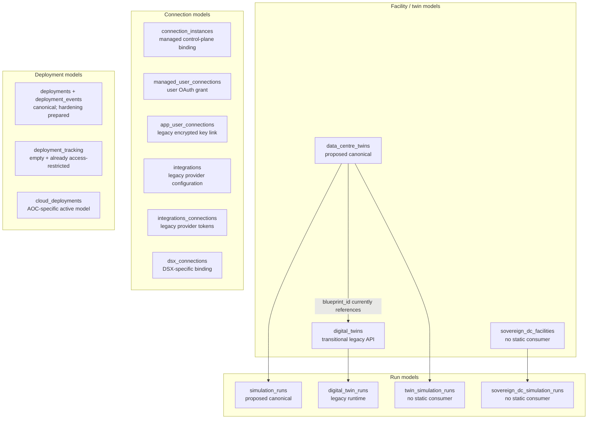

# AURA DC current-state architecture

- Status: exact-code audit baseline; not a deployment claim
- Audited local commit: `1fa9f5ed3e7ee70a9adbd17eaf3a1d2667cb228d`
- Audit date: 2026-08-30
- Repository: `m2mtechconnect/m2mdc`
- Schema source: generated Supabase client contract at
  `src/integrations/supabase/types.ts`; the deployed database must still be
  compared before any schema change

This document replaces architectural assumptions with a reproducible inventory.
Run `npm run audit:architecture` to regenerate the summary. The audit is static:
dynamic calls, scheduled jobs, webhooks, SQL-only consumers and external clients
require separate evidence before deletion.

## Why prior audits missed structural issues

Previous qualification concentrated on rendered routes, user journeys and release
checks. Those checks found real UI and wiring regressions, but they could not prove
that the schema and source tree had one authoritative model. Three conditions
created false confidence:

1. Architecture documents described older snapshots. In particular, some reports
   still said that organization and membership tables did not exist, while the
   generated contract now contains `organizations`, `org_memberships` and many
   organization-scoped tables.
2. Route and visual tests verify observable behaviour, not table semantics,
   foreign-key coverage, scheduled consumers or duplicate domain models.
3. A file or Edge Function with no static caller is only a candidate. It can still
   be called dynamically, by a webhook, a schedule, SQL, an external service or an
   older deployed client. Treating static reachability as deletion proof would be
   unsafe.

The corrected supervisor gate now requires this exact-head architecture inventory,
the diagrams below, a naming/retirement ledger and per-item removal evidence before
it can recommend destructive cleanup.

## Repository inventory

| Item | Exact-head result | Interpretation |
|---|---:|---|
| Tables | 140 | Generated client contract; deployed-schema comparison still required |
| Views | 5 | Generated client contract |
| Database functions | 49 | Generated client contract |
| Declared relationships | 112 | Relationships visible in generated types |
| Migration files | 86 | History must remain immutable |
| Opaque migration names | 70 | Historical debt; use descriptive names going forward |
| Edge Function directories | 165 | Repository inventory, not deployed-function proof |
| Functions statically invoked in repo | 42 | Lower bound only |
| Functions configured in `supabase/config.toml` | 25 | Explicit local configuration |
| Functions declared production by route allowlist | 22 | Default-deny production declaration |
| Tables with direct static consumers | 118 | Lower bound only |
| Tables with no direct static consumer | 28 | Investigation candidates, not dead tables |
| Isolated table candidates | 12 | No static consumer and no generated relationship |
| Tables without a resolvable org/user scope path | 34 | Mix of intentional global catalogs and review items |
| Tables without RLS migration evidence | 0 | Preserve this invariant |
| Tables without policy migration evidence | 0 | Preserve this invariant |
| Runtime source files | 1,059 | Excludes tests and declarations |
| Reachable from `src/main.tsx` | 883 | Static import graph only |
| Unreachable source candidates | 176 | Investigation candidates, not deletion proof |
| Exact duplicate source groups | 0 | Similar semantic implementations still exist |

## System and trust-boundary view

The diagram shows components present in the repository. It does not claim that an
external provider or accelerated runtime is deployed.



Security invariants:

- Browser code never owns privileged service credentials.
- RLS and tenant isolation remain enabled during every migration stage.
- `dsx-ingest` is the documented custom-auth exception; all other exceptions must
  be explicitly classified and fail closed.
- External runtime, deployment or NVIDIA capability is `unavailable` until runtime
  evidence proves otherwise.

## Organization, facility and run data path

Solid arrows are generated relationships. Dashed arrows are logical ownership that
still needs a declared foreign key or an explicit documented reason not to have one.



The deployment investigation is now complete. The deployed tables were empty at
inspection time, but the canonical model had no system/user/organization foreign
keys, no organization scope, owner-only RLS and unexpectedly broad authenticated
grants. A forward-only hardening migration is prepared on the audit branch; it is
not represented here as deployed state. See
`docs/architecture/deployment-ownership-remediation-2026-08-30.md`.

## Parallel domain models



This overlap explains why apparently simple UI changes can reach different backend
paths. Consolidation must move one caller group at a time and preserve compatibility
until production evidence shows the old path is unused.

## Proposed canonical boundaries

| Domain | Proposed authoritative model | Transitional or specialized models |
|---|---|---|
| Organization access | `organizations`, `org_memberships` | Keep policy/audit tables specialized |
| Data-centre facility | `data_centre_twins` | `digital_twins` transitional; `sovereign_dc_facilities` verify then retire if unused |
| Simulation | `simulation_runs` with provenance fields | `digital_twin_runs`, `twin_simulation_runs`, `sovereign_dc_simulation_runs` migrate/verify |
| Managed connections | `connector_definitions`, `connection_instances` | `managed_user_connections` remains the user OAuth grant; DSX remains specialized |
| Deployments | `deployments`, `deployment_events` after scope/FK hardening | `cloud_deployments` specialized; `deployment_tracking` delayed retirement candidate |
| Agent templates | `agent_templates` | `industry_templates` verify wizard dependency; `m2m_templates` verify then retire |
| Facility blueprints | `dc_blueprint_templates` | Do not present a generic marketplace unless product scope explicitly restores it |

These are proposed boundaries, not an executed schema migration. The item-by-item
proof and ordering are maintained in
`docs/architecture/schema-and-code-retirement-ledger-2026-08-30.md`.

## Code organization target

The repository currently has large shared folders (`components`: 489 runtime files,
`lib`: 92, `pages`: 65) plus overlapping `context`/`contexts`, builder stores and
twin/simulation component families. The target is a product-domain slice with an
explicit public API:

```text
src/domains/<domain>/
  api/             # typed server calls; no UI
  model/           # domain types, validation and state
  ui/              # domain-specific components
  routes/          # route entry points
  tests/           # characterization and contract tests
  index.ts          # reviewed public exports only
```

Shared code is restricted to genuinely cross-domain primitives. Dependency
direction is `app -> domain public API -> platform adapters`; domains do not import
another domain's internal files.

## Evidence-based cleanup order

1. Compare generated types to the deployed schema and record drift.
2. Classify all 34 no-scope tables as global catalog, user-owned,
   organization-owned or defect. Do not create blanket RLS exceptions.
3. Characterize callers and stored data for one duplicate family.
4. Introduce the canonical API or compatibility view and dual-read verification.
5. Backfill in bounded batches with counts and checksums.
6. Move callers, observe production telemetry through the compatibility window and
   prove zero old-path use.
7. Remove code in a small reversible change.
8. Remove schema only in a later contraction migration. Never edit or delete an
   applied migration file.

## Public repository patterns consulted

No upstream source code was copied. The supervisor learned governance patterns from
exact pinned revisions:

- Supabase `86c813ec03e340ffbe4aeb97cd0c5bee7a0ead94` (Apache-2.0): descriptive
  UTC migrations and policies/RLS delivered with table creation.
- PostHog `e0f5c3492380e64f2f8c1d549486413481ca3b6f` (MIT outside separately
  licensed `ee/`): product vertical slices and two-phase destructive migrations.
- Backstage `d5731882a9a45a6dea41df40ce9c25dafc2b4859` (Apache-2.0): ADRs,
  explicit package roles and reviewed public import surfaces.
- Mattermost `c8b1cc0046c9ab53de4cb33804a7b4bc5cd03a83` (mixed; see repository
  license): one purpose per migration, backward compatibility, lock analysis and
  realistic-volume migration testing.

These sources inform the process only. AURA's security, product truth, tenant model
and existing contracts remain the deciding evidence.
