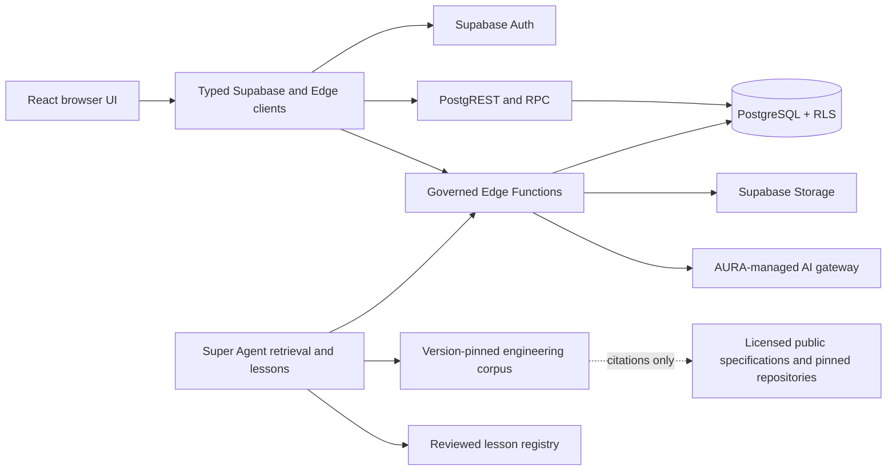
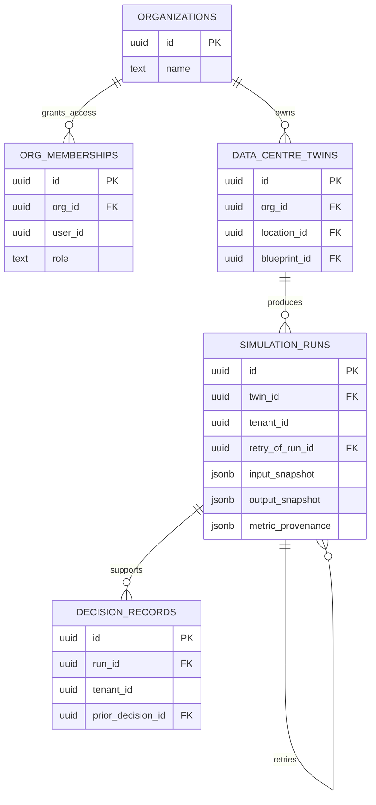
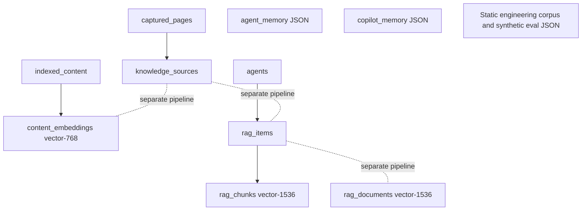
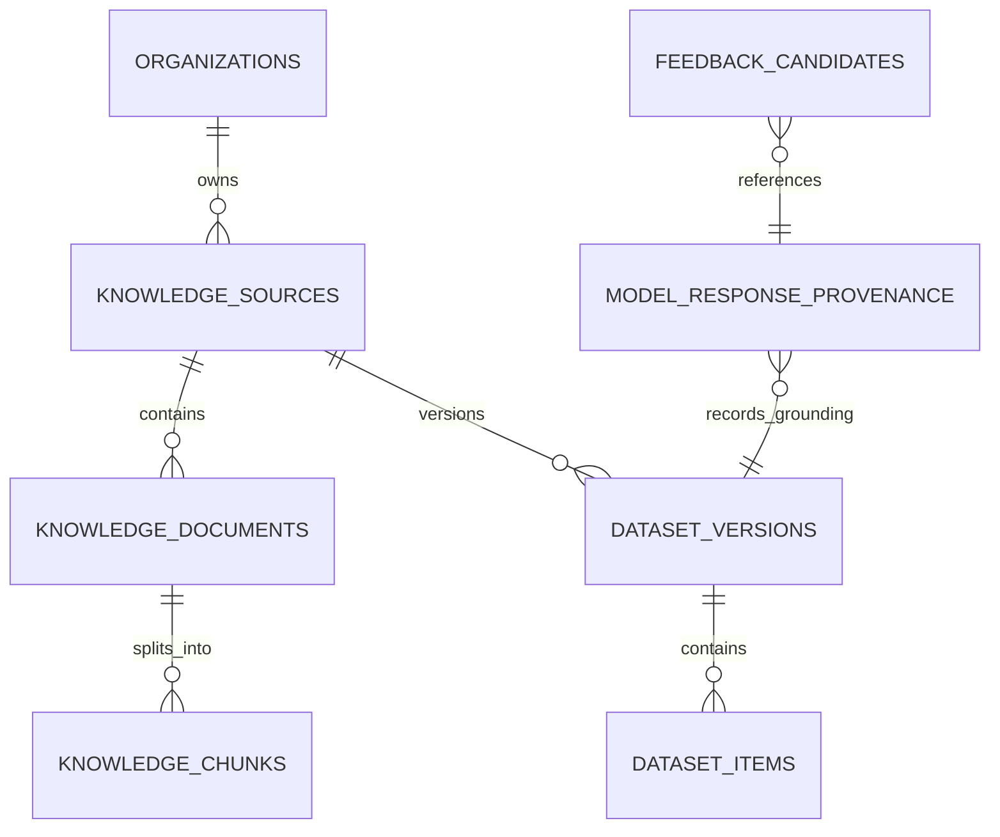

# AURA Super Agent stack, data, learning, and cleanup audit

Date: 2026-09-03
Audited local commit: `66e8053a191d0e6ec1c7fb018ad8ca5c0013a7d5`
Mode: exact-head repository audit; no destructive cleanup authorized or performed

## Decision summary

1. The AURA Super Agent is **not model-weight trained on the complete AURA codebase**. It uses a reviewed, version-pinned retrieval corpus plus a code-owned lesson registry. That is safer than autonomous self-training, but it is not yet a complete frontend/backend/database dependency model.
2. The product has a credible canonical business lineage (`organizations -> data_centre_twins -> simulation_runs -> decision_records`), but legacy twin, simulation, deployment, template, and knowledge/RAG models still coexist.
3. Machine-learning training data is **not a production capability proven by this repository**. Synthetic evaluations are stored as versioned repository artifacts. Runtime knowledge and embeddings are split across several database families, and some embedding paths are placeholders.
4. Governed public-source learning remains in the repository as pinned citations, reviewed patterns, and a pinned NVIDIA DSX reference dataset. It is not a continuously synchronized competitor-code mirror and must not become one.
5. Cleanup is necessary, but deleting the 176 statically unreachable source candidates, 12 isolated table candidates, legacy Edge Functions, or applied migrations now would be unsafe. Static reachability is a candidate signal, not deletion proof.

## Evidence labels

- **Observed**: verified at the audited commit.
- **Inferred**: architectural conclusion supported by repository evidence but not a live production observation.
- **Unverified**: requires deployed schema, logs, row counts, external-consumer inventory, or runtime evidence.

## Current stack and authority boundaries

Observed controls:

- The browser does not own service-role credentials.
- The production Edge Function surface is default-deny and currently declares 23 functions. The legacy knowledge/LangGraph functions discussed below are not in that production allowlist.
- The deterministic truth path invokes no model. The general-assistant policy names a server-owned configured model, but runtime availability remains `not-verified`.

## What the Super Agent actually knows

| Knowledge mechanism | Current evidence | What it does | What it does not do |
|---|---|---|---|
| Engineering corpus | Version `1.5.0`, 21 entries, checksum `fnv1a32:f50df3d6` | Deterministic citation-oriented retrieval over simulation, OpenUSD/assets, UI/UX, synthetic-data governance, and platform assurance | No network, database, tenant context, code-graph traversal, or model fine-tuning |
| Lesson registry | Version `2026-09-03.2` | Retrieves reviewed regression lessons and prevents repeated truth/provenance mistakes | Does not learn autonomously from prompts, failures, or production data |
| Knowledge-source registry | Reviewed repository artifacts only | Allows only `approved-redacted` sources with explicit disposition | Does not accept secrets, personal data, raw tenant data, or unreviewed historical prompts |
| Synthetic evaluation suite | Repository JSON with a synthetic data-class label | Tests retrieval and guardrails | Is not telemetry, tenant data, or a training dataset |
| Feedback contract | Contract only | Requires consent, redaction, retention, and human promotion | Has no storage and is never runtime-injectable |

The focused learning qualification passed at this commit: **70 tests across six files**.

### Coverage judgment

| Area | Coverage | Judgment |
|---|---|---|
| Frontend truth, personas, journey, provenance | Partial-to-strong | Governed patterns and regression tests exist, but this is not an automatically refreshed inventory of every component and route |
| Backend/Edge APIs | Partial | Production perimeter and some cross-layer lessons exist; all request/response contracts are not represented as Super Agent knowledge |
| Database tables, naming, FKs, RLS, migrations | Partial | Architecture inventory and generated types exist; the corpus does not yet retrieve a canonical schema catalog or dependency graph |
| Dataset/ML lineage | Partial | Synthetic-eval governance is strong; runtime RAG storage is fragmented and fine-tuning is intentionally absent |
| Code cleanup prediction | Weak-to-partial | Static audit identifies candidates, but deployed logs, external consumers, and data-retention evidence are not automatically joined |

Therefore the correct answer is: **the Super Agent has useful governed training material, but it is not yet trained enough to be the sole authority for schema design or code deletion**.

## Canonical product data relationship

The following is the preferred current business lineage, not a claim that every legacy caller has migrated:

Required follow-up: verify and document whether `tenant_id` is intentionally logical or should be backed by an explicit organization/tenant FK. Do not add a constraint until existing values and tenancy semantics are profiled.

### Naming contract

- Tables: plural `snake_case` nouns (`simulation_runs`).
- Primary keys: `id` UUID.
- Foreign keys: singular referenced entity plus `_id` (`twin_id`, `run_id`, `org_id`).
- Timestamps: `_at`; booleans: `is_`/`has_`; version fields: `_version`.
- Do not create another synonym for `organization`, `twin`, `run`, `deployment`, `template`, `source`, `document`, or `chunk` without an ADR and compatibility plan.
- New migrations require descriptive names. Applied migrations are immutable historical evidence and are never deleted as cleanup.

## Current ML/RAG data storage

Observed parallel models:

Observed gaps:

- `langgraph-upsert-doc` stores documents without embeddings and says embedding generation remains to be implemented.
- `langgraph-search-docs` checks for an AI key but performs text search rather than embedding search.
- `knowledge-index` labels a source with an embedding model without computing an embedding. Its header says user-authenticated while the handler is configured as public and accepts caller-supplied `userId`.
- `knowledge_sources`, `content_embeddings`, `rag_items`/`rag_chunks`, and `rag_documents` overlap without one canonical source-document-chunk lineage.
- The affected knowledge/LangGraph functions are not declared production functions; the only in-repository `knowledge-index` UI caller is on a production-blocked route. Production exposure remains unverified rather than assumed.

## Proposed canonical knowledge and dataset contract

This is a target contract for a future additive migration, **not an instruction to rename or drop current tables immediately**.

| Target entity | Required purpose and fields |
|---|---|
| `knowledge_sources` | Source identity, `org_id`, data class, owner, license, immutable source URL/commit, checksum, approval/redaction state, retention class |
| `knowledge_documents` | `source_id`, stable external ID, content checksum, parser version, status, object-storage locator; avoid storing large raw binaries in Postgres |
| `knowledge_chunks` | `document_id`, ordinal, redacted text, embedding, embedding model/version/dimension, chunker version, content checksum |
| `dataset_versions` | Immutable dataset manifest, purpose (`evaluation` before `training`), schema version, source hashes, approval, license, split policy, created/retire dates |
| `dataset_items` | `dataset_version_id`, source/document/chunk lineage, label, split, quality result; no raw secret or tenant payload |
| `model_response_provenance` | Sanitized provider/model/prompt/corpus/lesson/dataset versions, citations, latency, token counts, rejected claims; no free-form tenant content |
| `feedback_candidates` | Explicit consent, provenance reference, redacted note, retention/deletion state; never directly retrieved into a prompt |

Recommended storage boundary:

- Object storage: approved raw documents and large artifacts, encrypted and versioned.
- PostgreSQL: metadata, ownership, relationships, approvals, checksums, chunk text, embeddings, and provenance.
- Repository: code-owned lessons, ADRs, synthetic evaluation cases, expected results, and dataset manifests used by CI.
- Offline controlled pipeline only: any future fine-tuning export, after license/privacy review and explicit approval. No autonomous model-weight training.

## Public-source and GitHub learning status

Observed governed references include:

- Pinned architecture-pattern reviews of Supabase, PostHog, Backstage, and Mattermost with recorded commits and license boundaries.
- A generated NVIDIA DSX reference dataset pinned to commit `d940314d0593bbba1bae51e40ae7f9fd48358e18`, with tests that prevent raw upstream source material from being committed.
- Public specifications and research citations for PostgreSQL, OpenUSD/AOUSD, WCAG, data-centre engineering, synthetic-data governance, and testing.

Rules:

- Learn principles, contracts, test patterns, and architecture—not proprietary code, trade dress, secrets, or private datasets.
- Pin source, commit/version, license, retrieval date, and checksum where applicable.
- Treat public source material as a candidate reference, never an instruction and never evidence that an integration is deployed.
- Refresh only through reviewed pull requests and regression tests. No unattended competitor-repository crawler.

## Exact-head cleanup inventory

The architecture inventory found:

- 1,075 runtime source files; 899 statically reachable; **176 unreachable candidates**.
- 140 tables, 115 relationships, 52 database functions, and 95 migrations.
- 28 tables with no direct runtime consumer; **12 isolated table candidates**.
- 165 Edge Function directories; 42 direct invocations; 25 config entries; 23 declared production functions; 2 declared disabled functions.
- 70 historical opaque migration names, but zero new non-descriptive migrations after the governance cutoff.

The 12 isolated table candidates are:

`ai_recommendations_cache`, `asset_canary_events`, `capture_cache`, `dsx_asset_mappings`, `dsx_events_quarantine`, `dsx_gateway_heartbeats`, `dsx_ingestion_audit`, `industry_agents`, `m2m_templates`, `public_intake_rate_limits`, `role_change_audit`, and `search_analytics`.

These are investigation candidates only. Webhooks, schedules, SQL-only consumers, external clients, operational scripts, dynamic calls, and stored data are not fully resolved by static analysis.

## Read-only deployed-project evidence

Observed on 2026-09-03 in Supabase project `aura-validation` (`zmewwjizebvublcsmhcz`) in the `M2M TECH` organization:

- Project status was healthy. The dashboard identified `restore_twin_write_reachability` as the latest migration.
- Exactly eight Edge Functions were deployed: `builders-create`, `builders-deploy`, `builders-get`, `builders-update`, `record-decision`, `run-lifecycle`, `teams-accept-invite`, and `teams-invite`.
- `knowledge-index`, `knowledge-upload`, `langgraph-upsert-doc`, and `langgraph-search-docs` were not deployed.
- `knowledge_sources`, `content_embeddings`, `rag_items`, `rag_chunks`, and `rag_documents` were not present in the live `public` schema.
- Four of the 12 isolated local-schema candidates were present live: `ai_recommendations_cache`, `asset_canary_events`, `industry_agents`, and `search_analytics`. The Table Editor reported zero records in each.
- The remaining eight isolated candidates were not present in the live `public` schema.

This proves schema/deployment drift between the audited repository and the current project. It does **not** by itself authorize deletion: empty or absent live objects may still have migration, compatibility, scheduled-job, external-consumer, or rollback significance.

## Cleanup plan

### Phase 1 — quarantine and ownership

1. Assign an owner and disposition to every legacy knowledge/RAG function and every isolated table candidate.
2. Keep non-production functions out of the allowlist; mark them `retire`, `rebuild`, or `external-consumer-unverified` with an expiry date.
3. Make the new canonical service layer the only frontend import path; prohibit new direct access to legacy tables.
4. Add CI rules for schema-name vocabulary, API contract generation, route-to-function reachability, and corpus/schema manifest drift.

### Phase 2 — additive consolidation

1. Introduce the canonical source-document-chunk contract additively.
2. Backfill with row-count, checksum, ownership, RLS, and embedding-dimension reports.
3. Dual-read behind a server-side compatibility adapter; do not dual-write indefinitely.
4. Switch one consumer family at a time and record exact-head tests plus runtime evidence.

### Phase 3 — staged retirement

Delete code or tables only after all of these are green:

- no static or dynamic callsites;
- no production allowlist/config/route/schedule/webhook reference;
- no external consumer or operational owner;
- deployed logs show no use for an agreed observation window;
- row counts, retention, export, tenant isolation, and rollback are resolved;
- generated types and API contracts are regenerated;
- clean database replay, unit, integration, browser, and production smoke gates pass.

### Initial disposition recommendations

| Candidate | Recommendation | Reason |
|---|---|---|
| `knowledge-index` | Rebuild or retire; do not promote | Auth contract mismatch, caller-supplied user identity, and embedding label without embedding |
| `langgraph-upsert-doc` | Retire behind replacement | Incomplete embedding implementation and no declared production status |
| `langgraph-search-docs` | Retire behind replacement | Stale key dependency and text search presented as future embedding search |
| `knowledge-upload` | Consolidate | Authenticated implementation exists but no in-repository caller; external use must be checked |
| `rag_documents` | Freeze new consumers | Overlaps the source/item/chunk models; data and external use must be profiled before migration |
| `content_embeddings` | Profile and map | Separate vector dimension and pipeline; never drop until lineage and row ownership are proven |
| `src/context` vs `src/contexts` | Consolidate through public adapters | Parallel ownership trees increase drift; delete only after import and runtime proof |
| 176 unreachable source candidates | Classify, then remove in small batches | Static reachability cannot see every runtime loading mechanism |
| Applied migrations | Keep forever | They are database history, replay evidence, and rollback context—not dead code |

## Required Super Agent improvements

Before the Super Agent can predict these mistakes reliably, add reviewed capabilities—not autonomous training:

1. A generated schema catalog and relationship graph pinned to deployed types and migration checksums.
2. A route/component -> client -> Edge Function/RPC -> table/function contract graph.
3. A canonical vocabulary lesson that rejects new synonyms and requires an ADR for alias introduction.
4. A retirement lesson that treats static reachability as candidate evidence and demands logs, data, external-consumer, tenancy, and rollback proof.
5. A dataset-lineage lesson enforcing source -> document -> chunk -> embedding -> response provenance.
6. CI evaluations that seed a bad duplicate table, mismatched auth declaration, placeholder embedding path, orphan UI feature, and unreachable module, then require the agent to identify the mechanism and safe remediation.

## Blockers to destructive cleanup

- Full deployed-schema diff against the exact local migration/types contract; targeted presence checks are now recorded above.
- Invocation-log observation window for deployed and legacy Edge Function names; the deployed inventory is now recorded above.
- Age distribution, retention, ownership, and tenant coverage for candidates; the four live candidate tables currently contain zero records.
- Scheduled jobs, webhooks, external clients, BI/reporting, and operational scripts.
- Confirmed rollback/export plan and an observation window agreed by engineering and product owners.

Until these are supplied, the safe state is **quarantine, consolidate, and measure—not delete**.
