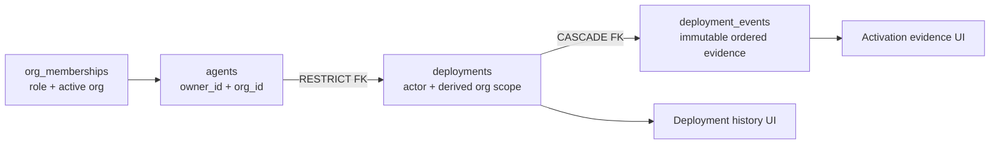

# Deployment ownership remediation

- Status: implementation prepared on an audit branch; not applied or deployed
- Repository baseline: `1fa9f5ed3e7ee70a9adbd17eaf3a1d2667cb228d`
- Deployed schema inspected: 2026-08-30 through the Lovable Supabase read-only connector
- Production mutations performed by this audit: none

## Outcome

`deployments` and `deployment_events` are the canonical AURA activation record.
The consolidation already happened. The remaining defect is an ownership and
integrity mismatch: the interface grants organization permissions while the
deployed database still authorizes only the original user.

## Deployed evidence

The read-only comparison found:

- `deployments`, `deployment_events`, `deployment_tracking` and
  `cloud_deployments` each contain zero rows in the inspected environment.
- `deployments` has no foreign key to `agents`, `auth.users` or
  `organizations`, and has no `org_id`.
- `deployment_events` relates only to its parent deployment. Its `system_id` and
  `actor_id` are not constrained.
- authenticated grants on the canonical tables include `TRUNCATE`, `DELETE`,
  `REFERENCES` and `TRIGGER`, even though the intended application contract is
  narrower. RLS does not protect `TRUNCATE`.
- 714 of 715 agents have a null `org_id`. A sudden `deployments.org_id NOT NULL`
  requirement would therefore break the current legacy population.
- the UI grants `deployment.view` to organization viewers and
  `deployment.execute` to execution-capable roles, but current RLS remains
  original-user-only.
- `deployment_tracking` is already isolated to `service_role` and empty. It is a
  delayed retirement candidate, not another active model.
- `cloud_deployments` is a specialized AOC model and remains outside this change.

## Prepared forward fix

Migration `20260830184500_harden_deployment_ownership.sql`:

1. adds nullable `deployments.org_id` and derives it from the referenced agent;
2. fails closed on orphan systems or missing deployment actors;
3. adds validated restrictive foreign keys for deployment and event systems,
   actors and organization;
4. derives organization and actor fields in database triggers rather than
   trusting browser payloads;
5. retains owner-only behavior for legacy null-organization agents;
6. aligns organization reads with active membership and writes with the
   execution-capable role set;
7. preserves append-only events and narrows table grants so authenticated users
   cannot update, delete or truncate evidence.

The application change also makes event-write failures propagate. A successful
activation can no longer be shown when its immutable evidence did not persist.
The system-delete function now blocks hard deletion when deployment evidence
exists instead of attempting to delete that evidence.

## Persona acceptance contract

| Persona | Expected result after migration |
|---|---|
| Organization owner/admin | View active-organization deployment evidence; execute activation |
| Operator/engineer/manager | View evidence; execute activation when the active organization matches |
| Executive/compliance/data analyst/viewer | View active-organization evidence; cannot create or update activation state |
| Legacy agent owner | Existing null-organization behavior remains owner-only |
| Unrelated tenant member | No read or write access |
| Anonymous user | No table privileges |

## Qualification and rollout

Before application, run `scripts/audit-deployment-ownership.sql` and retain its
output with the exact release SHA. Apply only after the same orphan counts remain
zero. Then verify each persona above, event ordering, evidence append failure,
system hard-delete denial, and cross-tenant denial.

Rollback is forward-only: restore the prior policies and grants while retaining
the added column and foreign keys. Do not drop evidence or remove the new scope
column during an incident. The nullable legacy bridge remains until agent tenancy
backfill has its own measured migration and rollback plan.

## Isolated rehearsal evidence

The migration at commit `ce97b358` was rehearsed on 2026-08-30 against the
existing unpublished **AURA PR13 UX Audit Sandbox** database. No Lovable project
was created or duplicated. The sandbox deployment tables matched the production
pre-migration column and policy shape and contained zero agents, deployments,
events, organizations and authentication users.

The sandbox predates `org_memberships` and the current organization helper
functions, so it is not a complete production clone. For qualification only,
their current deployed semantics and synthetic persona fixtures were created
inside one database transaction. The exact migration body and all assertions ran
inside that transaction, followed by an explicit rollback.

Observed results:

- migration syntax, column nullability, five new ownership constraints, five RLS
  policies, three authority triggers and restricted grants: **pass**;
- organization owner activation and server-derived organization/actor fields:
  **pass**;
- organization operator activation, own-record update and event append: **pass**;
- viewer read access with create/update denial: **pass**;
- unrelated-organization read and create denial: **pass**;
- legacy null-organization owner compatibility and non-owner denial: **pass**;
- anonymous table-access denial: **pass**;
- event system/actor correction from the parent deployment and session: **pass**;
- authority-field reassignment denial and system deletion blocked by retained
  deployment evidence: **pass**;
- rollback verification for schema changes, helper functions and every synthetic
  fixture: **pass**.

This proves the migration against the relevant prior deployment schema and the
persona policy contract. It does not replace a clean full migration replay or a
production-like data-volume/locking test. Those remain required before applying
the migration to production.

## Deferred, explicit follow-ups

- replace the system-delete function's best-effort multi-table cleanup with one
  transactional server-owned operation;
- align system deletion authorization with the accepted organization role model;
- audit and narrow `cloud_deployments` grants as a separate AOC change;
- prove zero external/reporting use of `deployment_tracking` before any drop;
- migrate legacy null-organization agents before considering an `org_id NOT NULL`
  constraint.
